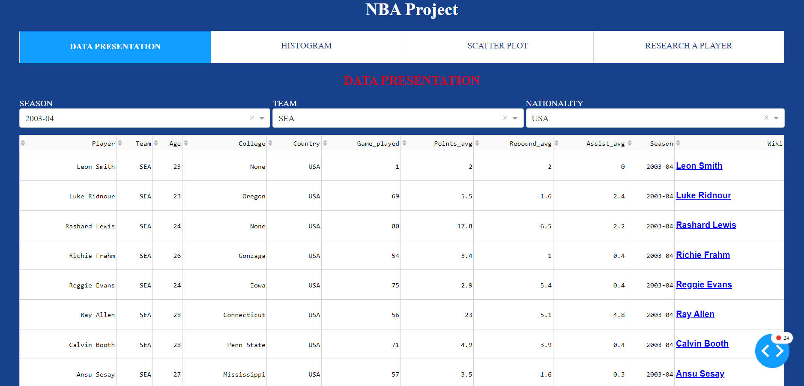
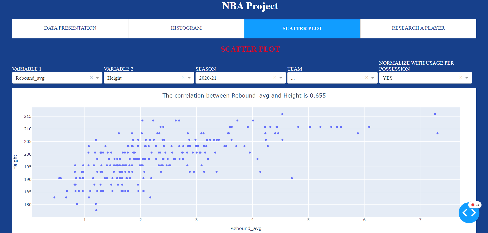
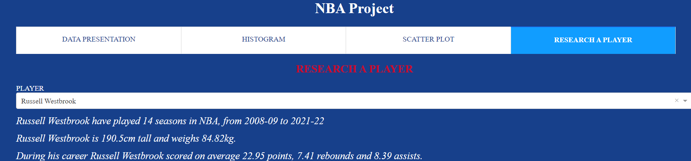

# Projet de logiciel spécialisé : Julia (Master 1 SSD)

## Objectif

L'objectif de ce projet était de découvrir un nouveau langage (Julia). Pour cela j'ai réalisé une application web (Dash) contenant une analyse de données intéractive.

## Réalisation

### Page 1

L'objectif de la première page est de présenter les données à l'utilisateur. Pour cela il va pouvoir le DataFrame via différentes variables (saison, équipe...). Une fois son filtre effectué l'utilisateur peut aller voir la page wikipédia (via un lien dans le DataFrame) des joueurs s'il veut des informations plus complètes.

### Page 2

Pour l'analyse univariée j'ai choisi un histogramme car la majorité des variables du DataFrame sont quantitatives. L'utilisateur commence par choisir une variable quantitatives puis il peut filtrer les données à l'aide de la variable saison. De plus il peut choisir s'il veut un histogramme en effectif ou en probabilité ainsi que le nombre de "bin".

### Page 3

Cette page permet à l'utilisateur de faire une analyse avec deux variables quantitatives. L'objectif de ce nuage de points est d'observer s'il y a des corrélations entre différentes variables. J'ai rajouté une fonctionnalité "Normalize with usage per possession" afin de lisser les données des joueurs ne jouant pas le même nombre de minute par match.

### Page 4

Si l'utilisateur veut un résumé de la carrière d'un joueur il peut le faire rapidement à l'aide de cette page.

